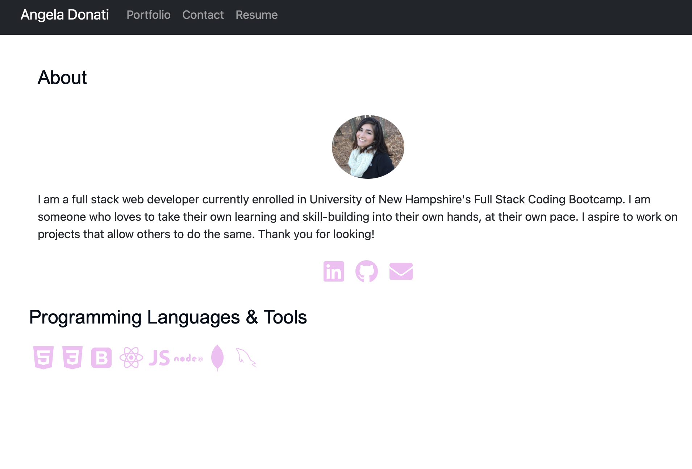

# react-portfolio

## Description

Updated personal portfolio page that has been recreated using React.js. The deployed site contains an About page which is the homepage, Portfolio page, Contact page and a link to my resume. Social media and github links are included.

## Usage

The page has a nav bar at the top that contains links to my portfolio, a contact page, and my resume. Clicking the links will render new page.

[Click here for my deployed React portfolio page](https://a-donati.github.io/react-portfolio/)

## Questions

- Contact me via [email](mailto:angeladonati93@gmail.com)
- View my GitHub [profile](http://www.github.com/a-donati)
